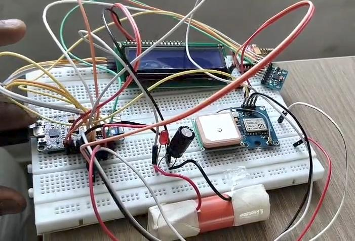
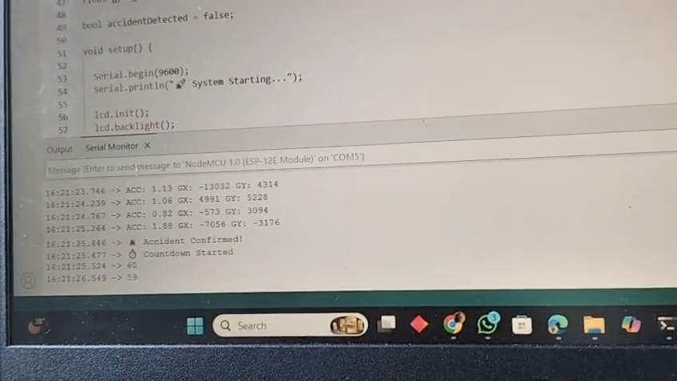

# 🚑 Smart Accident Detection and Emergency Response System

---

## 📌 Overview

Road accidents are one of the leading causes of fatalities worldwide, often due to delayed emergency response. This project presents a **Smart Accident Detection and Emergency Response System** that integrates embedded hardware and web technologies to automatically detect accidents and immediately notify emergency contacts along with precise location details and nearby hospital information.

The system uses **ESP8266**, **MPU6050 sensor**, **GPS module**, and **GSM communication**, along with a **Flask-based backend server**, to create a reliable and real-time emergency alert solution.

---

## 🎯 Objectives

* ✅ Detect accidents automatically using sensor data
* ✅ Reduce emergency response time
* ✅ Provide real-time GPS location tracking
* ✅ Notify emergency contacts via SMS
* ✅ Identify and share nearest hospital location
* ✅ Support both online and offline functionality

---

## 🧠 System Architecture

The system is divided into two main modules:

### 🔹 Embedded System (ESP8266)

* Reads sensor data from MPU6050
* Detects abnormal acceleration and rotation
* Fetches GPS coordinates
* Sends SMS alerts using GSM module
* Communicates with Flask server when internet is available

### 🔹 Backend Server (Flask API)

* Receives GPS coordinates from ESP8266
* Fetches nearby hospitals using external APIs
* Calculates nearest hospital using distance algorithm
* Returns structured JSON response

---

## 🔧 Hardware Components

* ESP8266 (NodeMCU)
* MPU6050 (Accelerometer + Gyroscope)
* GPS Module (Neo-6M)
* GSM Module (SIM800 / SIM900)
* LCD Display (I2C 16x2)
* Buzzer
* Push Button
* Power Supply Unit

---

## 💻 Software Technologies

* Arduino IDE (Embedded Programming)
* Python (Flask Framework)
* REST API Integration
* JSON Data Handling
* HTTP Communication
* Geo-location APIs (Geoapify, OpenStreetMap Overpass)

---

## ⚙️ Key Features

* ✔ Automatic accident detection using motion sensors
* ✔ Real-time GPS tracking
* ✔ SMS alert system for emergency contacts
* ✔ Nearest hospital detection via API
* ✔ Google Maps integration for navigation
* ✔ Manual cancellation option (false alert prevention)
* ✔ Dual-mode operation (Online + Offline)
* ✔ LCD display for system status
* ✔ Buzzer alert during emergency countdown

---

## 🔄 Working Principle

### 1️⃣ Accident Detection

* MPU6050 continuously monitors acceleration and rotation
* If threshold exceeds predefined limits → potential accident

### 2️⃣ Confirmation Stage

* System re-checks sensor data
* Avoids false positives

### 3️⃣ Countdown Mechanism

* 60-second delay with buzzer alert
* User can cancel using button

### 4️⃣ Location Acquisition

* GPS module fetches latitude and longitude

### 5️⃣ Mode Selection

#### 🌐 Online Mode

* Sends request to Flask server
* Fetches nearest hospital details

#### 📴 Offline Mode

* Sends SMS with current location only

### 6️⃣ Emergency Alert

* SMS sent to emergency contacts and hospitals
* Includes Google Maps location link

---

## 🚀 Getting Started

### 🔹 1. Clone Repository

```
git clone https://github.com/your-username/Smart-Accident-Detection-and-Emergency-Response-System.git
cd Smart-Accident-Detection-and-Emergency-Response-System
```

---

### 🔹 2. Setup Server

```
cd server
pip install -r ../requirements.txt
python server.py
```

Server will run at:

```
http://127.0.0.1:5000
```

---

### 🔹 3. Configure API Key

Create a `.env` file in the root folder:

```
API_KEY=your_api_key_here
```

---

### 🔹 4. Upload ESP Code

* Open `esp/accident_system.ino` in Arduino IDE
* Select board: **NodeMCU 1.0 (ESP8266)**
* Select correct COM port
* Upload the code

---

## 📡 API Usage

### Request

```
GET /data?lat=<latitude>&lon=<longitude>
```

### Example

```
http://127.0.0.1:5000/data?lat=11.0168&lon=76.9558
```

### Response

```
{
  "name": "Hospital Name",
  "lat": 11.50,
  "lon": 77.28,
  "distance_km": 2.5,
  "map": "https://maps.google.com/?q=..."
}
```

---

## 🔐 Security Considerations

* API keys are stored securely in `.env` file
* `.env` is excluded using `.gitignore`
* Prevents exposure of sensitive credentials

---

## 📸 Project Demo (Add Images)

## 📸 Hardware Setup




### 🔹 Serial Monitor Output



### 🔹 SMS Alert Example


---

## 📊 Advantages

* ✔ Fully automated system
* ✔ Reduces human dependency
* ✔ Fast emergency communication
* ✔ Works even without internet
* ✔ Cost-effective solution
* ✔ Scalable for smart city applications

---

## ⚠️ Limitations

* GPS signal may fail indoors
* GSM network dependency for SMS
* API response delay in poor internet
* Sensor calibration required

---

## 🚀 Future Enhancements

* 📱 Mobile application integration
* ☁️ Cloud-based monitoring system
* 📊 Real-time dashboard
* 🤖 AI-based accident prediction
* 🚗 Integration with vehicle systems
* 📍 Live tracking for emergency services

---

## 🤝 Contributions

Contributions are welcome!

Steps:

1. Fork the repository
2. Create a new branch
3. Make changes
4. Submit a pull request

---

## 👨‍💻 Author

**GOKUL VG and DIVYA NANDHINI V**

---

## 📌 Conclusion

This project demonstrates how IoT and web technologies can be combined to build a real-time, life-saving system. By automating accident detection and emergency response, it significantly improves safety and response efficiency in critical situations.

---

⭐ If you found this project useful, consider giving it a star!
